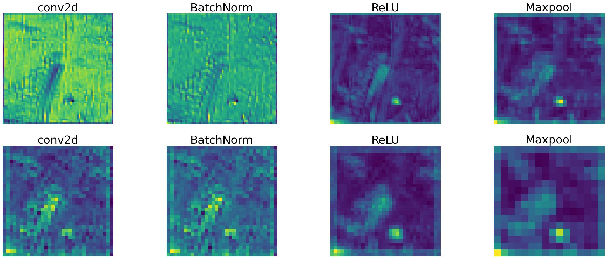
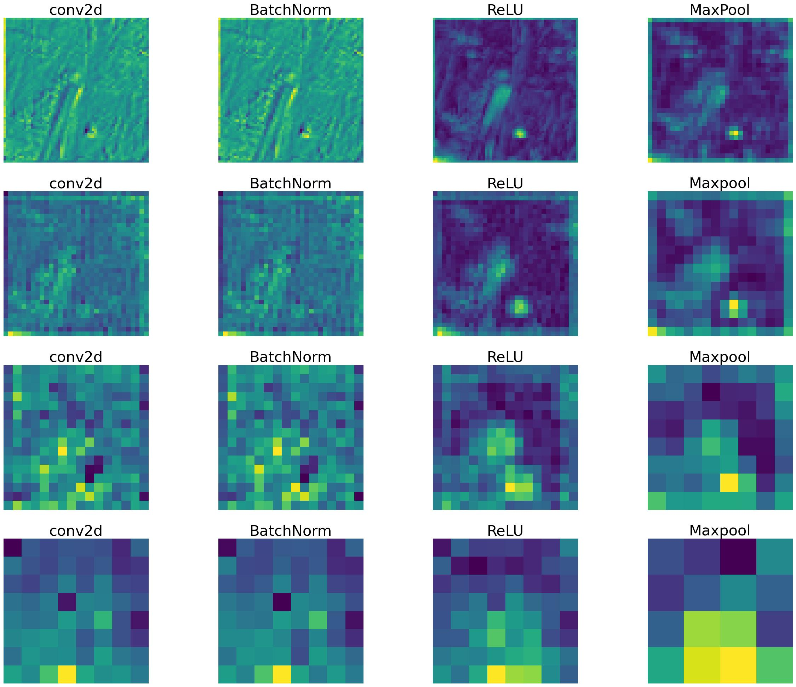
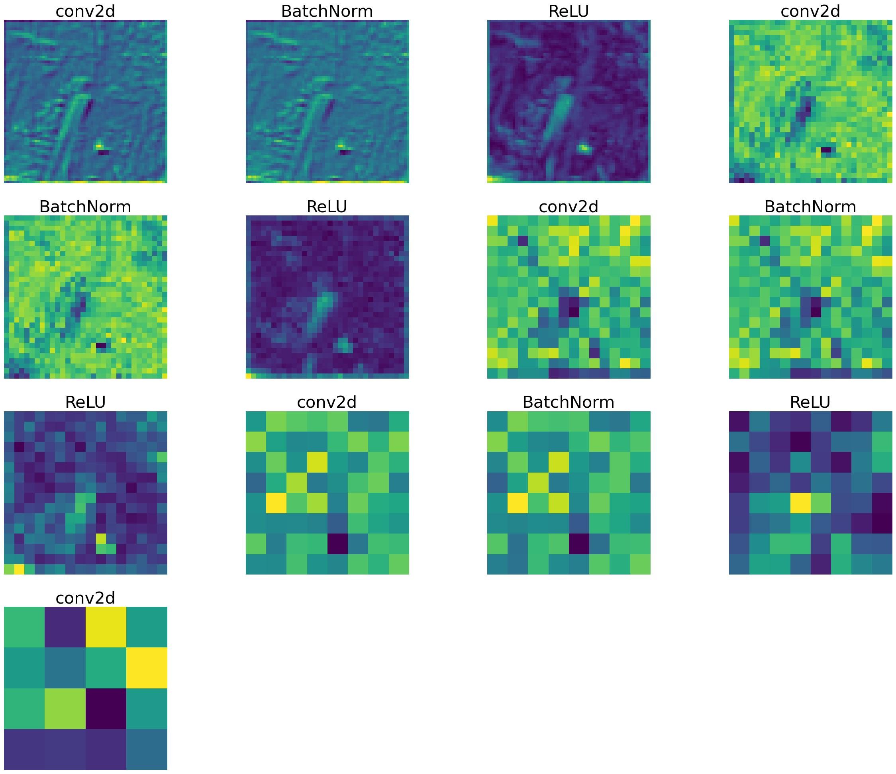

- Often times you wonder what happends behind the scene or what happens when we pass the input onto each layer.

- The following code snippet illustrates how to gain insights into what happens behind the scenes and how the input is processed through each layer. For this demonstration, a Kaggle dataset called “Intel Image Classification” is used:

## Importing Libraries

```
import os

import torch
import torch.nn as nn
import torch.nn.functional as F
import torchvision
import torchvision.transforms as transforms
from torchvision import datasets, models, transforms

import pandas as pd
import numpy as np

import matplotlib.pyplot as plt
import seaborn as sns
```
##  Loading Intel Image Classification

```
train_data_dir = '/kaggle/input/intel-image-classification/seg_train/seg_train'
test_data_dir = '/kaggle/input/intel-image-classification/seg_test/seg_test'
pred_data_dir = '/kaggle/input/intel-image-classification/seg_pred/seg_pred'
```

## Hyperparameter

```
kernel_size_cnn = 3
kernel_size_pool = 2
stride1 = 1
stride2 = 2
padding = 1
batch_size = 256
epochs = 50
ratio = 64
in_channels = 3
hidden_channels1 = 64
hidden_channels2 = 128
```

Tune this as you need


## Finding the mean and standard deviation of the dataset
```
train = datasets.ImageFolder(train_data_dir,
 transform = transforms.Compose([
 transforms.Resize(ratio),
 transforms.RandomCrop(ratio),
 transforms.ToTensor()
 ]))
train_data_loader = torch.utils.data.DataLoader(train, 64, shuffle=True, num_workers=3, pin_memory=True)
def get_mean_std(data_loader):
 sum_, squared_sum, batches = 0, 0, 0
 for data, _ in data_loader:
 sum_ += torch.mean(data, dim=([0, 2, 3]))
 squared_sum += torch.mean(data ** 2, dim=([0, 2, 3]))
 batches += 1
 
 mean = sum_ / batches
 std = (squared_sum / batches - mean ** 2) ** 0.5
 return mean, std
mean, std = get_mean_std(train_data_loader)
mean, std
```

## Transforms
```
train_transform = transforms.Compose([
 transforms.RandomResizedCrop(ratio),
 transforms.RandomHorizontalFlip(),
 transforms.ToTensor(),
 transforms.Normalize(mean, std)])
test_transform = transforms.Compose([
 transforms.Resize(ratio),
 transforms.CenterCrop(ratio),
 transforms.ToTensor(),
 transforms.Normalize(mean, std)])
```

## Preparing Dataset
```
train_datasets = datasets.ImageFolder(os.path.join(train_data_dir),
 transform=train_transform)
test_datasets = datasets.ImageFolder(os.path.join(test_data_dir),
 transform=test_transform)
classes = len(train_datasets.classes)
classes
val_size = int(len(train_datasets) * 0.2)
train_size = len(train_datasets) - val_size
train_datasets, val_datasets = torch.utils.data.random_split(train_datasets,
 [train_size, val_size])
len(train_datasets), len(val_datasets), len(test_datasets)
train_dataloaders = torch.utils.data.DataLoader(train_datasets, batch_size=batch_size * 2, shuffle=True,
 num_workers=2, pin_memory=True)
val_dataloaders = torch.utils.data.DataLoader(val_datasets, batch_size=batch_size * 2,
 num_workers=2, pin_memory=True)
test_dataloaders = torch.utils.data.DataLoader(test_datasets, batch_size=batch_size * 2,
 num_workers=2, pin_memory=True)
```

## Invoking CUDA
```
CUDA = torch.cuda.is_available()
CUDA
```

## Feature Representation
```
from PIL import Image
img = Image.open('/kaggle/input/intel-image-classification/seg_train/seg_train/forest/10007.jpg')
img.size
image = train_transform(img)
image = image.unsqueeze(0)
if CUDA:
 image = image.cuda()
image.shape
```

## Simple CNN Model
```
class CNN11(nn.Module):
 def __init__(self, in_channels, hidden_channels1, hidden_channels2, out_channels,
 kernel_size_cnn=3, kernel_size_pool=2,
 stride1=1, stride2=2, padding=1):
 super().__init__()
self.cnn1 = nn.Conv2d(in_channels=in_channels,
 out_channels=hidden_channels1,
 kernel_size=kernel_size_cnn,
 stride=stride1,
 padding=padding)
 self.batchnorm1 = nn.BatchNorm2d(hidden_channels1)
 self.relu = nn.ReLU()
 self.maxpool = nn.MaxPool2d(kernel_size=kernel_size_pool)
 
 self.cnn2 = nn.Conv2d(in_channels=hidden_channels1,
 out_channels=hidden_channels2,
 kernel_size=kernel_size_cnn,
 stride=stride1,
 padding=padding)
 self.batchnorm2 = nn.BatchNorm2d(hidden_channels2)
 
 self.fc1 = nn.Flatten()
 self.dropout = nn.Dropout(0.4)
 self.linear_layer = 32768
 self.fc2 = nn.Linear(self.linear_layer, out_channels)
 
 def forward(self, x):
 outputs = []
 labels = []
out = self.cnn1(x)
 outputs.append(out)
 labels.append('conv2d')
out = self.batchnorm1(out)
 outputs.append(out)
 labels.append('BatchNorm')
out = self.relu(out)
 outputs.append(out)
 labels.append('ReLU')
out = self.maxpool(out)
 outputs.append(out)
 labels.append('Maxpool')
 
 out = self.cnn2(out)
 outputs.append(out)
 labels.append('conv2d')
out = self.batchnorm2(out)
 outputs.append(out)
 labels.append('BatchNorm')
out = self.relu(out)
 outputs.append(out)
 labels.append('ReLU')
out = self.maxpool(out)
 outputs.append(out)
 labels.append('Maxpool')
 
 out = self.fc1(out)
 out = self.relu(out)
 out = self.fc2(out)
 return outputs, labels
```

## Model

```
model11 = CNN11(in_channels=in_channels,
 hidden_channels1=hidden_channels1,
 hidden_channels2=hidden_channels2,
 out_channels=classes)
if CUDA:
 model11 = model11.cuda()
outputs, labels = model11(image)
```

## Preprocess

```
processed = []
for feature_map in outputs:
 feature_map = feature_map.squeeze(0)
 gray_scale = torch.sum(feature_map, 0)
 gray_scale = gray_scale / feature_map.shape[0]
 processed.append(gray_scale.data.cpu().numpy())
```

## Display Image
```
fig = plt.figure(figsize=(30, 50))
for i in range(len(processed)):
 a = fig.add_subplot(8, 4, i + 1)
 imgplot = plt.imshow(processed[i])
 plt.axis('off')
 a.set_title(labels[i], fontsize=30)
 
plt.savefig('feature_maps1.jpg', bbox_inches='tight')
```



## Try2: CNN with additional Layer

```
class CNN2(nn.Module):
 def __init__(self, in_channels, hidden_channels1, hidden_channels2, out_channels,
 kernel_size_cnn=3, kernel_size_pool=2,
 stride1=1, stride2=2, padding=1):
 
 super().__init__()
 
 self.cnn1 = nn.Conv2d(in_channels=in_channels,
 out_channels=hidden_channels1,
 kernel_size=kernel_size_cnn,
 stride=stride1,
 padding=padding)
 self.batchnorm1 = nn.BatchNorm2d(hidden_channels1)
 self.relu = nn.ReLU()
 self.maxpool = nn.MaxPool2d(kernel_size=kernel_size_pool)
self.cnn2 = nn.Conv2d(in_channels=hidden_channels1,
 out_channels=hidden_channels1,
 kernel_size=kernel_size_cnn,
 stride=stride1,
 padding=padding)
 self.batchnorm2 = nn.BatchNorm2d(hidden_channels2)
self.fc1 = nn.Flatten()
 self.dropout = nn.Dropout(0.4)
 self.linear_layer = 1024
 
 self.fc2 = nn.Linear(self.linear_layer, out_channels)
 
 def forward(self, x):
 
 outputs = []
 labels = []
 
 out = self.cnn1(x)
 outputs.append(out)
 labels.append('conv2d')
 
 out = self.batchnorm1(out)
 outputs.append(out)
 labels.append('BatchNorm')
 
 out = self.relu(out)
 outputs.append(out)
 labels.append('ReLU')
 
 out = self.maxpool(out)
 outputs.append(out)
 labels.append('MaxPool')
 # [256, 32, 32, 64]
 
 out = self.cnn2(out) 
 labels.append('conv2d')
 outputs.append(out)
 
 out = self.batchnorm1(out)
 outputs.append(out)
 labels.append('BatchNorm')
 
 out = self.relu(out)
 labels.append('ReLU')
 outputs.append(out)
 
 out = self.maxpool(out)
 outputs.append(out)
 labels.append('Maxpool')
 # [256, 16, 16, 64]
 
 out = self.cnn2(out) 
 labels.append('conv2d')
 outputs.append(out)
 
 out = self.batchnorm1(out)
 outputs.append(out)
 labels.append('BatchNorm')
 
 out = self.relu(out)
 labels.append('ReLU')
 outputs.append(out)
 
 out = self.maxpool(out)
 outputs.append(out)
 labels.append('Maxpool')
 # [256, 8, 8, 64]
 
 out = self.cnn2(out) 
 labels.append('conv2d')
 outputs.append(out)
 
 out = self.batchnorm1(out)
 outputs.append(out)
 labels.append('BatchNorm')
 
 out = self.relu(out)
 labels.append('ReLU')
 outputs.append(out)
 
 out = self.maxpool(out)
 outputs.append(out)
 labels.append('Maxpool')
 
 # [256, 4, 4, 64]
 
 out = self.fc1(out)
 out = self.relu(out)
 out = self.fc2(out)
 
 return outputs, labels
```

## Model
```
model1 = CNN2(in_channels=in_channels,
 hidden_channels1=hidden_channels1,
 hidden_channels2=hidden_channels2,
 out_channels=classes)
if CUDA:
 model1 = model1.cuda()
outputs, labels = model1(image)
```

## Preprocess
```
processed = []
for feature_map in outputs:
 feature_map = feature_map.squeeze(0)
 gray_scale = torch.sum(feature_map, 0)
 gray_scale = gray_scale / feature_map.shape[0]
 processed.append(gray_scale.data.cpu().numpy())
```

## Display Image
```
fig = plt.figure(figsize=(30, 50))
for i in range(len(processed)):
 a = fig.add_subplot(8, 4, i + 1)
 imgplot = plt.imshow(processed[i])
 plt.axis('off')
 a.set_title(labels[i], fontsize=30)
 
plt.savefig('feature_maps2.jpg', bbox_inches='tight')
```



## Try 3: CNN without MaxPooling and stride of 2
```
class CNN22(nn.Module):
 # in_channels is the color channels in our case it is 3
 def __init__(self, in_channels, hidden_channels1, hidden_channels2, out_channels,
 kernel_size_cnn=3, kernel_size_pool=2,
 stride1=1, stride2=2, padding=1):
 
 super().__init__()
 
 self.cnn1 = nn.Conv2d(in_channels=in_channels,
 out_channels=hidden_channels1,
 kernel_size=kernel_size_cnn,
 stride=stride1,
 padding=padding)
 self.batchnorm1 = nn.BatchNorm2d(hidden_channels1)
 self.relu = nn.ReLU()
 self.maxpool = nn.MaxPool2d(kernel_size=kernel_size_pool)
 
 self.cnn2 = nn.Conv2d(in_channels=hidden_channels1,
 out_channels=hidden_channels1,
 kernel_size=kernel_size_cnn,
 stride=stride1,
 padding=padding)
 self.batchnorm2 = nn.BatchNorm2d(hidden_channels2)
 
 self.fc1 = nn.Flatten()
 self.dropout = nn.Dropout(0.4)
 self.linear_layer = 1024
 self.fc2 = nn.Linear(self.linear_layer, out_channels)

 def forward(self, x):
 
 outputs = []
 labels = []
 
 out = self.cnn1(x)
 outputs.append(out)
 labels.append('conv2d')
 
 out = self.batchnorm1(out)
 outputs.append(out)
 labels.append('BatchNorm')
 
 out = self.relu(out)
 outputs.append(out)
 labels.append('ReLU')
 
 out = self.maxpool(out)
 outputs.append(out)
 labels.append('MaxPool')
 # [256, 32, 32, 64]
 
 out = self.cnn2(out) 
 labels.append('conv2d')
 outputs.append(out)
 
 out = self.batchnorm1(out)
 outputs.append(out)
 labels.append('BatchNorm')
 
 out = self.relu(out)
 labels.append('ReLU')
 outputs.append(out)
 
 out = self.maxpool(out)
 outputs.append(out)
 labels.append('Maxpool')
 # [256, 16, 16, 64]
 
 out = self.cnn2(out) 
 labels.append('conv2d')
 outputs.append(out)
 
 out = self.batchnorm1(out)
 outputs.append(out)
 labels.append('BatchNorm')
 
 out = self.relu(out)
 labels.append('ReLU')
 outputs.append(out)
 
 out = self.maxpool(out)
 outputs.append(out)
 labels.append('Maxpool')
 # [256, 8, 8, 64]
 
 out = self.cnn2(out) 
 labels.append('conv2d')
 outputs.append(out)
 
 out = self.batchnorm1(out)
 outputs.append(out)
 labels.append('BatchNorm')
 
 out = self.relu(out)
 labels.append('ReLU')
 outputs.append(out)
 
 out = self.maxpool(out)
 outputs.append(out)
 labels.append('Maxpool')
 
 # [256, 4, 4, 64]
 
 out = self.fc1(out)
 out = self.relu(out)
 out = self.fc2(out)
 
 return outputs, labels
```

## Model
```
model1 = CNN3(in_channels=in_channels,
 hidden_channels1=hidden_channels1,
 hidden_channels2=hidden_channels2,
 out_channels=classes)
if CUDA:
 model1 = model1.cuda()
outputs, labels = model1(image)
```

## Preprocess
```

processed = []
for feature_map in outputs:
 feature_map = feature_map.squeeze(0)
 gray_scale = torch.sum(feature_map, 0)
 gray_scale = gray_scale / feature_map.shape[0]
 processed.append(gray_scale.data.cpu().numpy())
```

## Display Image
```

fig = plt.figure(figsize=(30, 50))
for i in range(len(processed)):
 a = fig.add_subplot(8, 4, i + 1)
 imgplot = plt.imshow(processed[i])
 plt.axis('off')
 a.set_title(labels[i], fontsize=30)
 
plt.savefig('feature_maps3.jpg', bbox_inches='tight')
```



